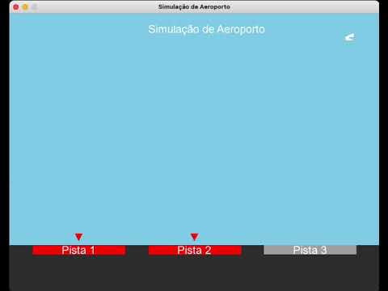

# Simulação de Aeroporto

[](https://youtu.be/WGdEENzyzUM)

## 📖 Descrição

Este projeto é uma **simulação de aeroporto** desenvolvida em **C++** utilizando as bibliotecas **SDL2** e **SDL2_ttf**. A aplicação permite configurar parâmetros como tempo de pouso, desembarque, decolagem, intervalo entre aviões, número de pistas e quantidade de aviões. Após a configuração, a simulação visualiza o processo de aterrissagem e decolagem dos aviões de maneira dinâmica, gerenciando múltiplas pistas através de semáforos para evitar conflitos.

## 🚀 Funcionalidades

- **Configuração Personalizada**: Ajuste os tempos de pouso, desembarque, decolagem e intervalo entre aviões, bem como o número de pistas e aviões.
- **Simulação Realista**: Aviões aterrissam, desembarcando passageiros, decolam e liberam pistas automaticamente.
- **Gestão de Pistas**: Utilização de semáforos para gerenciar o acesso às pistas, evitando colisões.
- **Interface Intuitiva**: Interface gráfica amigável para facilitar a configuração e observação da simulação.

## 🔧 Requisitos

Antes de compilar e executar o projeto, certifique-se de que seu sistema atende aos seguintes requisitos:

- **Linguagem de Programação**: C++17
- **Compilador**:
  - **macOS**: GCC/G++ versão 14 ou superior
  - **Linux**: GCC/G++ versão 14 ou superior
  - **Windows**: MinGW ou outro compilador compatível com C++17
- **Bibliotecas**:
  - [SDL2](https://www.libsdl.org/download-2.0.php)
  - [SDL2_ttf](https://www.libsdl.org/projects/SDL_ttf/)
- **Outros**:
  - **Threads** e **Semáforos**: Implementados conforme os conceitos de Sistemas Operacionais.

## 📦 Instalação

### 1. Instalar as Bibliotecas SDL2 e SDL2_ttf

#### **macOS**

A instalação manual das bibliotecas é necessária no macOS. Siga os passos abaixo:

1. **Baixe as bibliotecas**:
   - [Download SDL2](https://www.libsdl.org/download-2.0.php)
   - [Download SDL2_ttf](https://www.libsdl.org/projects/SDL_ttf/)

2. **Extraia os arquivos** baixados.

3. **Copie as frameworks** para o diretório `/Library/Frameworks/`:

   Abra o Terminal e execute os seguintes comandos (substitua `/caminho/para/` pelo caminho onde as frameworks foram extraídas):

   ```bash
   sudo cp -r /caminho/para/SDL2.framework /Library/Frameworks/
   sudo cp -r /caminho/para/SDL2_ttf.framework /Library/Frameworks/
   ```

   **Nota**: Você pode precisar inserir sua senha de administrador para executar esses comandos.

#### **Linux**

No Linux, você pode instalar as bibliotecas SDL2 e SDL2_ttf utilizando o gerenciador de pacotes da sua distribuição. Abaixo estão os comandos para as distribuições baseadas em Debian/Ubuntu:

```bash
sudo apt update
sudo apt install libsdl2-dev libsdl2-ttf-dev
```

#### **Windows**

No Windows, siga os passos abaixo para instalar as bibliotecas SDL2 e SDL2_ttf:

1. **Baixe as bibliotecas**:
   - [Download SDL2](https://www.libsdl.org/download-2.0.php) (Selecione a versão de desenvolvimento para MinGW ou Visual Studio, conforme seu compilador)
   - [Download SDL2_ttf](https://www.libsdl.org/projects/SDL_ttf/)

2. **Extraia os arquivos** baixados.

3. **Configure o compilador**:
   - Para **MinGW**:
     - Copie os arquivos `.dll` para a pasta onde está o executável do seu projeto ou para `C:\MinGW\bin`.
     - Inclua os diretórios `include` e `lib` no seu projeto ou nas variáveis de ambiente do sistema.
   - Para **Visual Studio**:
     - Siga as instruções de integração específicas para Visual Studio disponíveis na documentação das bibliotecas.

## 🛠️ Compilação

Com as dependências instaladas, você pode compilar o projeto usando os seguintes comandos conforme o sistema operacional:

### 📄 Explicação do Comando

- `g++-14` / `g++`: Invoca o compilador GCC/G++.
- `-std=c++17`: Define o padrão C++17.
- `main.cpp aviao.cpp semaforo.cpp utils.cpp`: Arquivos de código-fonte a serem compilados.
- `-I./include`: Inclui o diretório `include` para cabeçalhos personalizados.
- **macOS**:
  - `-I/Library/Frameworks/SDL2.framework/Headers -I/Library/Frameworks/SDL2_ttf.framework/Headers`: Inclui os cabeçalhos das frameworks SDL2 e SDL2_ttf.
  - `-F/Library/Frameworks`: Indica o diretório onde as frameworks estão localizadas.
  - `-framework SDL2 -framework SDL2_ttf`: Liga as frameworks SDL2 e SDL2_ttf.
- **Linux**:
  - `-lSDL2 -lSDL2_ttf`: Liga as bibliotecas SDL2 e SDL2_ttf.
- **Windows**:
  - Depende da configuração do compilador, geralmente inclui caminhos para `include` e `lib` e linka as bibliotecas SDL2 e SDL2_ttf.
- `-pthread`: Liga a biblioteca pthread para suporte a multithreading.
- `-o main`: Define o nome do executável de saída como `main`.

### **macOS**

```bash
g++-14 -std=c++17 main.cpp aviao.cpp semaforo.cpp utils.cpp \
    -I./include -I/Library/Frameworks/SDL2.framework/Headers -I/Library/Frameworks/SDL2_ttf.framework/Headers \
    -F/Library/Frameworks \
    -framework SDL2 -framework SDL2_ttf -pthread -o main
```

### **Linux**

```bash
g++ -std=c++17 main.cpp aviao.cpp semaforo.cpp utils.cpp \
    -I./include \
    -lSDL2 -lSDL2_ttf -pthread -o main
```

### **Windows** (Usando MinGW)

```bash
g++ -std=c++17 main.cpp aviao.cpp semaforo.cpp utils.cpp \
    -I./include -I"C:/Path/To/SDL2/include" -I"C:/Path/To/SDL2_ttf/include" \
    -L"C:/Path/To/SDL2/lib" -L"C:/Path/To/SDL2_ttf/lib" \
    -lSDL2 -lSDL2_ttf -pthread -o main.exe
```

**Nota**: Substitua `C:/Path/To/` pelo caminho real onde as bibliotecas SDL2 e SDL2_ttf estão instaladas no seu sistema.

## ▶️ Execução

Após a compilação bem-sucedida, execute o programa com o seguinte comando conforme o sistema operacional:

### **macOS e Linux**

```bash
./main
```

### **Windows**

```bash
main.exe
```

## 🛠️ Uso

1. **Configuração**:
   - Ajuste os parâmetros desejados utilizando os botões "+" e "-" na interface de configuração:
     - **Tempo de Pouso (s)**: Tempo que o avião leva para pousar.
     - **Tempo de Desembarque (s)**: Tempo para desembarcar passageiros após o pouso.
     - **Tempo de Decolagem (s)**: Tempo que o avião leva para decolar após desembarcar.
     - **Tempo entre Aviões (s)**: Intervalo entre a chegada de cada avião (mínimo de 4 segundos).
     - **Número de Pistas**: Quantidade de pistas disponíveis para pouso e decolagem (máximo de 3).
     - **Número de Aviões**: Quantidade total de aviões na simulação.

2. **Iniciar Simulação**:
   - Clique no botão "Play" para iniciar a simulação.
   - Observe os aviões aterrissando, desembarcando passageiros, decolando e liberando pistas conforme as configurações definidas.

## 🧰 Tecnologias Utilizadas

- **Linguagem de Programação**: C++17
- **Bibliotecas**:
  - [SDL2](https://github.com/libsdl-org/SDL/releases/tag/release-2.30.10) Biblioteca para desenvolvimento de aplicações multimídia.
  - [SDL2_ttf](https://www.libsdl.org/projects/SDL_ttf/): Extensão da SDL2 para renderização de fontes TrueType.
- **Threads e Semáforos**: Implementados utilizando a biblioteca pthread e mecanismos de sincronização para gerenciar a concorrência.

## 📂 Estrutura do Projeto

```
project/
├── README.md
├── arial.ttf
├── aviao.cpp
├── aviao.h
├── main.cpp
├── pista.h
├── semaforo.cpp
├── semaforo.h
├── utils.cpp
└── utils.h
```

## 🧵 Implementação de Threads e Semáforos

Este projeto utiliza **threads** e **semaforos** para gerenciar a concorrência entre os aviões que tentam acessar as pistas de pouso e decolagem. A implementação segue os conceitos aprendidos na disciplina de **Sistemas Operacionais**.

### **Threads**

- **Definição**: Cada avião é representado por uma **thread** independente, responsável por sua movimentação e processos de pouso, desembarque, decolagem e liberação de pista.
- **Implementação**:
  - **Arquivo**: `aviao.cpp` e `aviao.h`
  - Cada thread simula o voo do avião, gerenciando seu estado e interações com as pistas.

### **Semáforos**

- **Definição**: Semáforos são utilizados para controlar o acesso às pistas, garantindo que apenas um número limitado de aviões possa pousar ou decolar simultaneamente.
- **Implementação**:
  - **Arquivo**: `semaforo.cpp` e `semaforo.h`
  - A classe `Semaforo` implementa os métodos `esperar` e `notificar` para controlar a disponibilidade das pistas.
  - As threads dos aviões utilizam esses métodos para adquirir e liberar pistas de forma sincronizada.

## 📫 Contato

Se você tiver dúvidas ou sugestões, sinta-se à vontade para entrar em contato:

- **Nome**: Felipe Azambuja
- **Email**: felipe.azamba@usp.br
- **GitHub**: [DeguShi](https://github.com/DeguShi)

---

## 📝 Notas Finais

- **Validação de Configurações**: O projeto garante que o **tempo entre aviões** não possa ser configurado para menos de **4 segundos**. Caso tente reduzir abaixo desse valor, o sistema impedirá a alteração e notificará o usuário.
  
- **Feedback Visual**: Botões desabilitados para reduzir o **tempo entre aviões** abaixo de 4 segundos são renderizados em cinza, indicando que não podem ser clicados.
  
- **Performance**: O programa foi otimizado para rodar a aproximadamente **60 FPS**, proporcionando uma simulação suave e de fácil compreensão.
  
- **Multiplataforma**: Embora a instalação das bibliotecas SDL2 e SDL2_ttf difira entre os sistemas operacionais, o projeto foi desenvolvido para ser **compatível com macOS, Linux e Windows**. Certifique-se de seguir as instruções de instalação específicas para o seu sistema.

---

## 🎓 Sobre o Projeto

Este projeto foi desenvolvido como parte do curso **SSC0140 – Sistemas Operacionais I** da **Universidade de São Paulo - ICMC**, sob a orientação da **Profª Kalinka Regina Lucas Jaquie Castelo Branco**. O objetivo principal foi implementar conceitos de **threads** e **semaforos** em um aplicativo prático, demonstrando a aplicação desses conceitos em um contexto realista de gerenciamento de recursos concorrentes.
